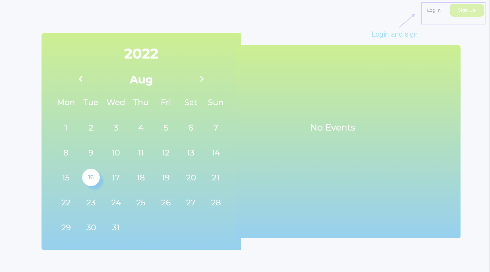
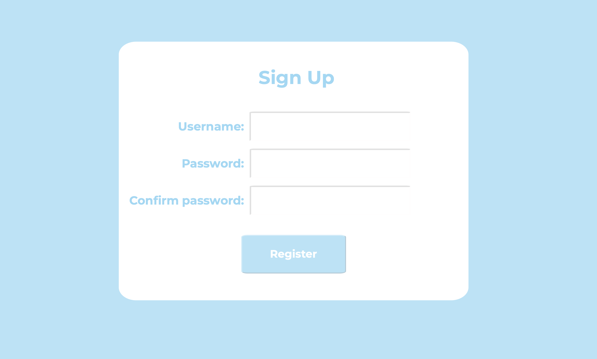
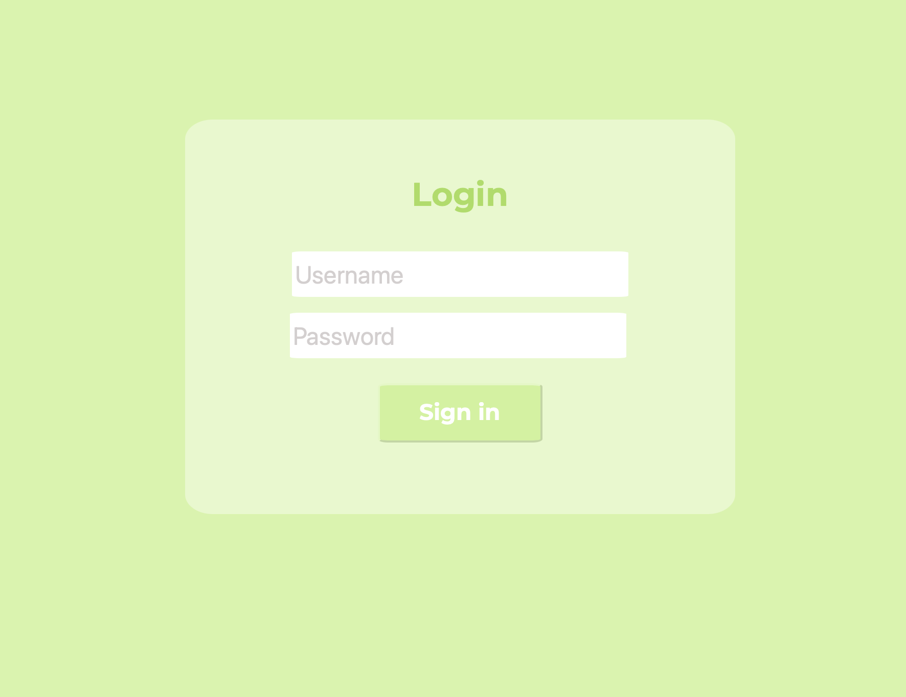
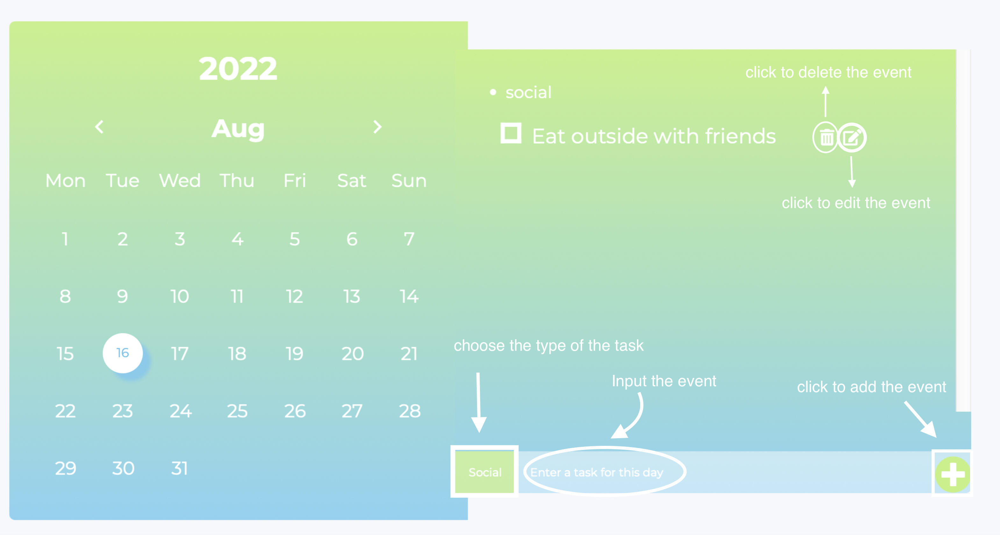
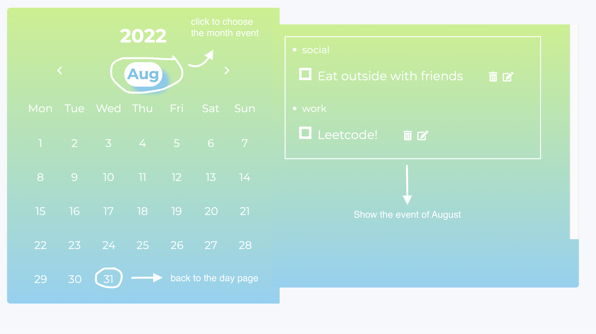
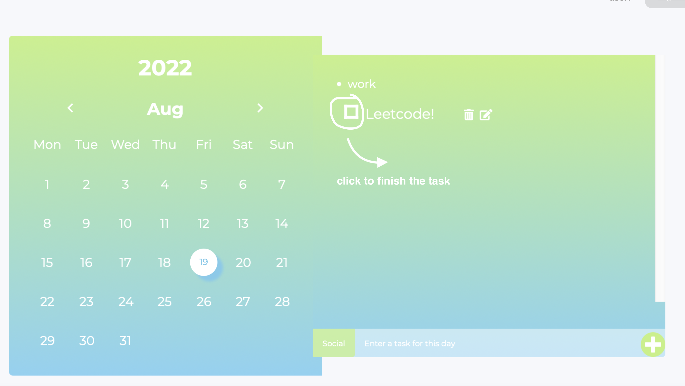

# Calender-
[Link](http://ec2-18-188-176-85.us-east-2.compute.amazonaws.com/~cocoz/module5/group/calendar.html) for login page of Calendar.
## Function of app
- Users can register and log in to the website
- Users can tag an event with ✔️ or ❌. If users finish the tasks, they could tage the tasks with ✔️.
- Registered users can add, edit and delete events.
- Events could be categorized as social,work......
- Users can view all the events every month.

## Calener use instruction

### Customer view
Unregistered users can't see events on the calendar.

### Register
If you'd like to create your own account, click sign up to register.

### Username and password
- user1 - 123456

### Add, edit and delete the task

### Monthly event board

### Tag an event with ✔️ or ❌

